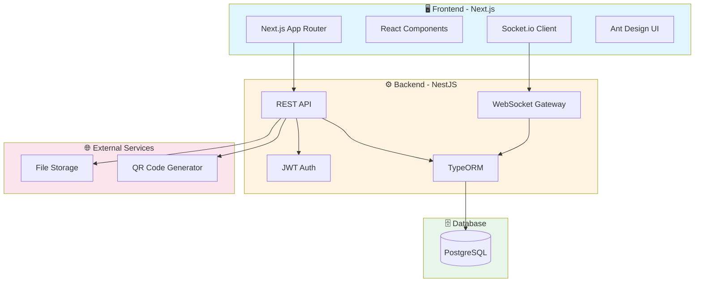

<div align="center">
  
  
  # 🍽️ Restaurant Management System
  
  ### *Hệ thống quản lý nhà hàng toàn diện, hiện đại*
  
  [](https://www.typescriptlang.org/)
  [](https://nextjs.org/)
  [](https://nestjs.com/)
  [](https://www.postgresql.org/)
  [](https://socket.io/)
  
  [🚀 Demo](#) • [📖 Documentation](./server/docs) • [🐛 Report Bug](#) • [💡 Request Feature](#)

</div>

---

## 📋 Mục lục

- [Giới thiệu](#-giới-thiệu)
- [Tính năng nổi bật](#-tính-năng-nổi-bật)
- [Kiến trúc hệ thống](#️-kiến-trúc-hệ-thống)
- [Công nghệ sử dụng](#-công-nghệ-sử-dụng)
- [Cài đặt](#-cài-đặt)
- [Hướng dẫn sử dụng](#-hướng-dẫn-sử-dụng)
- [API Documentation](#-api-documentation)
- [Screenshots](#-screenshots)
- [Contributing](#-contributing)
- [License](#-license)

---

## 🎯 Giới thiệu

**Restaurant Management System** là giải pháp quản lý nhà hàng toàn diện, được xây dựng với công nghệ hiện đại. Hệ thống hỗ trợ đầy đủ các quy trình từ đặt bàn, gọi món qua QR code, quản lý bếp real-time, đến quản lý kho và báo cáo thống kê chi tiết.

### 🎯 Đối tượng sử dụng

- 🏢 **Chủ nhà hàng**: Quản lý toàn bộ hoạt động, theo dõi doanh thu
- 👨‍💼 **Quản lý**: Giám sát nhân viên, phân quyền, quản lý menu
- 👨‍🍳 **Bếp trưởng**: Nhận đơn hàng real-time, cập nhật trạng thái món
- 💁 **Phục vụ**: Quản lý bàn, đặt món, thanh toán
- 📦 **Thủ kho**: Quản lý nguyên liệu, nhập xuất kho
- 👥 **Khách hàng**: Quét QR gọi món, theo dõi đơn hàng

---

## ✨ Tính năng nổi bật

### 📱 Gọi món QR Code - Không tiếp xúc

<table>
  <tr>
    <td width="50%">
      
**Khách hàng**
- 📲 Quét mã QR trên bàn
- 🍕 Xem menu với hình ảnh sinh động
- 🛒 Thêm món vào giỏ hàng
- 💬 Ghi chú yêu cầu đặc biệt
- 📊 Theo dõi trạng thái đơn hàng
- ⭐ Đánh giá món ăn sau khi dùng

</td>
<td width="50%">

**Nhà hàng**
- 🎯 Giảm thời gian chờ đợi
- ✅ Loại bỏ sai sót khi ghi chép
- 📈 Thu thập dữ liệu khách hàng
- 🔄 Cập nhật menu real-time
- 💰 Tăng doanh thu, giảm chi phí

</td>
  </tr>
</table>

### 👨‍🍳 Quản lý Bếp Real-time (WebSocket)

- 🔔 **Nhận đơn hàng tức thì** qua WebSocket
- ✅ **Xác nhận bắt đầu chế biến** từng món
- 🔄 **Cập nhật trạng thái** (preparing → ready → served)
- 📋 **Xem lịch sử** chế biến và hiệu suất
- ⏱️ **Theo dõi thời gian** chế biến mỗi món

### 🪑 Quản lý Bàn thông minh

- 🎨 **Sơ đồ bàn trực quan** với mã màu trạng thái
- 🟢 Available • 🟡 Reserved • 🔴 Occupied • 🔵 Cleaning
- 📊 **Dashboard** thống kê bàn trống/đang sử dụng
- 🔄 **Tự động cập nhật** trạng thái sau thanh toán
- 📱 **Quản lý QR code** cho từng bàn

### 📦 Quản lý Kho & Nguyên liệu

- ✏️ **CRUD** nguyên liệu, danh mục, nhà cung cấp
- 📥 **Nhập kho** với thông tin lô hàng, HSD
- 📤 **Xuất kho** tự động khi chế biến món
- 📊 **Kiểm kê** hàng tồn kho theo thời gian thực
- 🔍 **Truy xuất nguồn gốc** nguyên liệu từng món
- ⚠️ **Cảnh báo** nguyên liệu sắp hết, sắp hết hạn
- 🧾 **In hóa đơn** nhập xuất kho

### 💰 Thanh toán & Tài chính

- 💳 **Thanh toán đa hình thức** (tiền mặt, thẻ, ví điện tử)
- 🧾 **In hóa đơn** tự động
- 📊 **Báo cáo doanh thu** theo ngày/tuần/tháng
- 📈 **Thống kê** món bán chạy, khung giờ đông
- 💸 **Quản lý thu chi** nhà hàng
- 📑 **Xuất báo cáo** Excel, PDF

### 👥 Quản lý Nhân viên

- 🔐 **Phân quyền** theo vai trò (Admin, Manager, Chef, Waiter, Cashier)
- ✏️ **CRUD** tài khoản nhân viên
- 📊 **Theo dõi** hiệu suất làm việc
- 🔒 **Bảo mật** với JWT Authentication
- 📱 **Đăng nhập** đa thiết bị

### 🍽️ Quản lý Menu & Món ăn

- 🎨 **Thiết kế menu** đẹp mắt với hình ảnh
- 🏷️ **Danh mục** món ăn chi tiết
- 📝 **Mô tả** nguyên liệu, cách chế biến
- 💰 **Quản lý giá** linh hoạt
- 🔄 **Cập nhật** menu real-time
- ⭐ **Gợi ý món** phổ biến, khuyến mãi

---

## 🏗️ Kiến trúc hệ thống



### 📁 Cấu trúc thư mục

```
Restaurant-Management/
├── 📱 client/                 # Frontend Next.js
│   ├── public/               # Static assets
│   ├── src/
│   │   ├── app/             # App Router pages
│   │   │   ├── admin/       # Admin dashboard
│   │   │   ├── kitchen/     # Kitchen interface
│   │   │   ├── waiter/      # Waiter interface
│   │   │   ├── cashier/     # Cashier interface
│   │   │   └── customer/    # Customer ordering
│   │   ├── components/      # Shared components
│   │   ├── contexts/        # React contexts
│   │   ├── hooks/           # Custom hooks
│   │   └── services/        # API services
│   └── package.json
│
├── 🔧 server/                # Backend NestJS
│   ├── src/
│   │   ├── auth/           # Authentication module
│   │   ├── users/          # User management
│   │   ├── orders/         # Order processing
│   │   ├── dishes/         # Dish management
│   │   ├── ingredients/    # Ingredient management
│   │   ├── tables/         # Table management
│   │   ├── kitchen/        # Kitchen WebSocket
│   │   ├── financial/      # Financial reports
│   │   └── entities/       # TypeORM entities
│   ├── docs/               # API documentation
│   └── package.json
│
└── 📄 restaurant.sql         # Database schema

```

---

## 🛠️ Công nghệ sử dụng

### Frontend

| Công nghệ | Phiên bản | Mục đích |
|-----------|-----------|----------|
| **Next.js** | 15.3.2 | React framework với SSR/SSG |
| **React** | 18.2.0 | UI library |
| **TypeScript** | 5.x | Type safety |
| **Ant Design** | 5.25.1 | UI component library |
| **Tailwind CSS** | 4.1.5 | Utility-first CSS |
| **Socket.io Client** | 4.8.1 | Real-time communication |
| **Axios** | 1.9.0 | HTTP client |
| **React Hook Form** | 7.56.2 | Form management |
| **Framer Motion** | 12.12.1 | Animations |
| **Recharts** | 2.15.3 | Data visualization |

### Backend

| Công nghệ | Phiên bản | Mục đích |
|-----------|-----------|----------|
| **NestJS** | 11.0.1 | Node.js framework |
| **TypeScript** | 5.8.3 | Type safety |
| **TypeORM** | 0.3.22 | ORM for PostgreSQL |
| **PostgreSQL** | 8.15.5+ | Relational database |
| **Passport JWT** | 4.0.1 | Authentication |
| **Socket.io** | 4.8.1 | WebSocket server |
| **bcrypt** | 5.1.1 | Password hashing |
| **QRCode** | 1.5.4 | QR code generation |
| **Swagger** | 8.0.0 | API documentation |
| **Multer** | 1.4.5 | File upload |

---

## 🚀 Cài đặt

### 📋 Yêu cầu hệ thống

- **Node.js** >= 16.x (khuyến nghị 18.x hoặc 20.x)
- **npm** >= 8.x hoặc **yarn** >= 1.22
- **PostgreSQL** >= 14.x
- **Git**

### 1️⃣ Clone repository

```bash
git clone https://github.com/hoanghust2003/Restaurant-Management.git
cd Restaurant-Management
```

### 2️⃣ Cài đặt Backend

```bash
# Di chuyển vào thư mục server
cd server

# Cài đặt dependencies
npm install

# Tạo file .env từ template
cp .env.example .env
```

**Cấu hình file `.env`:**

```env
# Database
DATABASE_HOST=localhost
DATABASE_PORT=5432
DATABASE_USER=postgres
DATABASE_PASSWORD=your_password
DATABASE_NAME=restaurant_db

# JWT
JWT_SECRET=your_super_secret_key_change_this_in_production
JWT_EXPIRES_IN=7d

# Server
PORT=3001
NODE_ENV=development

# Frontend URL
FRONTEND_URL=http://localhost:3000

# File Upload
UPLOAD_DIR=./uploads
MAX_FILE_SIZE=5242880
```

**Tạo database và import schema:**

```bash
# Tạo database
createdb restaurant_db

# Import schema
psql restaurant_db < ../restaurant.sql

# Hoặc sử dụng pgAdmin/DBeaver để import file restaurant.sql
```

**Chạy server:**

```bash
# Development mode
npm run start:dev

# Production mode
npm run build
npm run start:prod
```

Server sẽ chạy tại: **http://localhost:3001**

### 3️⃣ Cài đặt Frontend

```bash
# Di chuyển vào thư mục client
cd ../client

# Cài đặt dependencies
npm install

# Tạo file .env.local
cp .env.example .env.local
```

**Cấu hình file `.env.local`:**

```env
# API URL
NEXT_PUBLIC_API_URL=http://localhost:3001

# WebSocket URL
NEXT_PUBLIC_WS_URL=http://localhost:3001

# App Config
NEXT_PUBLIC_APP_NAME=Restaurant Management
NEXT_PUBLIC_APP_VERSION=1.0.0
```

**Chạy client:**

```bash
# Development mode
npm run dev

# Production build
npm run build
npm start
```

Client sẽ chạy tại: **http://localhost:3000**

### 4️⃣ Tài khoản mặc định

Sau khi import database, bạn có thể đăng nhập với các tài khoản sau:

| Vai trò | Email | Password | Quyền hạn |
|---------|-------|----------|-----------|
| **Admin** | admin@restaurant.com | admin123 | Toàn quyền hệ thống |
| **Manager** | manager@restaurant.com | manager123 | Quản lý nhà hàng |
| **Chef** | chef@restaurant.com | chef123 | Quản lý bếp |
| **Waiter** | waiter@restaurant.com | waiter123 | Phục vụ, đặt món |
| **Cashier** | cashier@restaurant.com | cashier123 | Thu ngân |

> ⚠️ **Lưu ý**: Vui lòng đổi mật khẩu ngay sau lần đăng nhập đầu tiên!

---

## 📖 Hướng dẫn sử dụng

### 🔐 Đăng nhập

1. Truy cập **http://localhost:3000**
2. Nhấn **Đăng nhập**
3. Nhập email và password
4. Hệ thống sẽ chuyển đến dashboard tương ứng vai trò

### 👨‍💼 Dashboard Admin

**Chức năng:**
- 📊 Xem tổng quan doanh thu, đơn hàng
- 👥 Quản lý nhân viên, phân quyền
- 🍽️ Quản lý menu, món ăn, danh mục
- 📦 Quản lý kho, nhà cung cấp
- 💰 Xem báo cáo tài chính chi tiết
- ⚙️ Cấu hình hệ thống

**Các bước quản lý món ăn:**

1. Vào **Menu Management** → **Dishes**
2. Nhấn **+ Add New Dish**
3. Điền thông tin món ăn (tên, giá, mô tả)
4. Upload hình ảnh
5. Chọn danh mục và nguyên liệu
6. Nhấn **Save**

### 👨‍🍳 Dashboard Kitchen (Bếp)

**Chức năng:**
- 🔔 Nhận đơn hàng real-time
- ✅ Xác nhận bắt đầu chế biến
- 🔄 Cập nhật trạng thái món (preparing → ready)
- 📋 Xem queue món ăn đang chờ
- 📊 Thống kê hiệu suất bếp

**Quy trình xử lý đơn:**

1. Đơn hàng mới xuất hiện với thông báo âm thanh
2. Xem chi tiết món ăn, ghi chú của khách
3. Nhấn **Start Cooking** khi bắt đầu
4. Nhấn **Mark as Ready** khi hoàn thành
5. Phục vụ sẽ được thông báo để mang món

### 💁 Dashboard Waiter (Phục vụ)

**Chức năng:**
- 🪑 Xem sơ đồ bàn, trạng thái
- 📝 Tạo đơn hàng mới
- 🔄 Cập nhật trạng thái bàn
- 📱 Quản lý QR code
- 🔔 Nhận thông báo món ready

**Các bước đặt món cho khách:**

1. Chọn bàn trống (màu xanh)
2. Nhấn **New Order**
3. Chọn món từ menu
4. Nhập số lượng, ghi chú
5. Xác nhận đơn hàng
6. Bàn tự động chuyển sang trạng thái **Occupied**

### 💰 Dashboard Cashier (Thu ngân)

**Chức năng:**
- 💳 Thanh toán đơn hàng
- 🧾 In hóa đơn
- 📊 Xem doanh thu theo ca
- 💸 Quản lý các hình thức thanh toán

**Quy trình thanh toán:**

1. Xem danh sách đơn hàng chờ thanh toán
2. Chọn đơn hàng cần thanh toán
3. Kiểm tra lại các món, giá tiền
4. Chọn hình thức thanh toán
5. Nhập số tiền nhận, tiền thừa
6. Nhấn **Complete Payment**
7. In hóa đơn cho khách
8. Bàn tự động chuyển về **Available**

### 📱 Gọi món QR Code (Khách hàng)

**Quy trình:**

1. Quét mã QR trên bàn bằng camera điện thoại
2. Tự động mở menu với table ID
3. Chọn món ăn, xem hình ảnh, mô tả
4. Thêm vào giỏ hàng
5. Xem lại giỏ hàng, ghi chú
6. Xác nhận đặt món
7. Theo dõi trạng thái đơn hàng
8. Đánh giá món ăn sau khi dùng

---

## 📚 API Documentation

### 🔗 Swagger UI

Truy cập API documentation tại: **http://localhost:3001/api-docs**

### 📋 Các endpoint chính

#### Authentication

```http
POST   /api/auth/register      # Đăng ký tài khoản
POST   /api/auth/login         # Đăng nhập
GET    /api/auth/me            # Lấy thông tin user hiện tại
POST   /api/auth/logout        # Đăng xuất
```

#### Users

```http
GET    /api/users              # Lấy danh sách users
GET    /api/users/:id          # Lấy thông tin user
POST   /api/users              # Tạo user mới
PUT    /api/users/:id          # Cập nhật user
DELETE /api/users/:id          # Xóa user
```

#### Dishes

```http
GET    /api/dishes             # Lấy danh sách món ăn
GET    /api/dishes/:id         # Lấy chi tiết món ăn
POST   /api/dishes             # Tạo món ăn mới
PUT    /api/dishes/:id         # Cập nhật món ăn
DELETE /api/dishes/:id         # Xóa món ăn
```

#### Orders

```http
GET    /api/orders             # Lấy danh sách đơn hàng
GET    /api/orders/:id         # Lấy chi tiết đơn hàng
POST   /api/orders             # Tạo đơn hàng mới
PUT    /api/orders/:id         # Cập nhật đơn hàng
DELETE /api/orders/:id         # Xóa đơn hàng
POST   /api/orders/:id/pay     # Thanh toán đơn hàng
```

#### Tables

```http
GET    /api/tables             # Lấy danh sách bàn
GET    /api/tables/:id         # Lấy thông tin bàn
POST   /api/tables             # Tạo bàn mới
PUT    /api/tables/:id         # Cập nhật bàn
DELETE /api/tables/:id         # Xóa bàn
GET    /api/tables/:id/qr      # Lấy QR code của bàn
```

#### Ingredients

```http
GET    /api/ingredients        # Lấy danh sách nguyên liệu
GET    /api/ingredients/:id    # Lấy chi tiết nguyên liệu
POST   /api/ingredients        # Tạo nguyên liệu mới
PUT    /api/ingredients/:id    # Cập nhật nguyên liệu
DELETE /api/ingredients/:id    # Xóa nguyên liệu
```

### 🔒 Authentication

Tất cả các endpoint (trừ login/register) yêu cầu JWT token trong header:

```http
Authorization: Bearer <your_jwt_token>
```

---

## 📸 Screenshots

### 🏠 Landing Page
*Trang chủ hiện đại, thu hút*

### 📊 Admin Dashboard
*Tổng quan doanh thu, thống kê real-time*

### 👨‍🍳 Kitchen Interface
*Giao diện bếp với đơn hàng real-time*

### 📱 Customer Ordering
*Giao diện gọi món trên mobile*

### 🪑 Table Management
*Sơ đồ quản lý bàn trực quan*

---

## 🤝 Contributing

Chúng tôi hoan nghênh mọi đóng góp cho dự án! 

### Quy trình đóng góp:

1. **Fork** repository này
2. Tạo **branch** mới (`git checkout -b feature/AmazingFeature`)
3. **Commit** thay đổi (`git commit -m 'Add some AmazingFeature'`)
4. **Push** lên branch (`git push origin feature/AmazingFeature`)
5. Mở **Pull Request**

### Coding Standards:

- ✅ Sử dụng **TypeScript** strict mode
- ✅ Follow **ESLint** rules
- ✅ Viết **unit tests** cho code mới
- ✅ Comment code phức tạp
- ✅ Cập nhật **documentation** khi cần

---

## 📝 License

Dự án này được phân phối dưới giấy phép **MIT License**. Xem file [LICENSE](LICENSE) để biết thêm chi tiết.

---

## 👨‍💻 Tác giả

**Hoàng Huy** - [@hoanghust2003](https://github.com/hoanghust2003)

---

## 📞 Liên hệ & Hỗ trợ

- 📧 Email: hoanghust2003@gmail.com
- 🐛 Issues: [GitHub Issues](https://github.com/hoanghust2003/Restaurant-Management/issues)
- 💬 Discussions: [GitHub Discussions](https://github.com/hoanghust2003/Restaurant-Management/discussions)

---

## 🙏 Lời cảm ơn

Cảm ơn tất cả những người đã đóng góp cho dự án này!

- [NestJS](https://nestjs.com/) - Backend framework tuyệt vời
- [Next.js](https://nextjs.org/) - React framework mạnh mẽ
- [Ant Design](https://ant.design/) - UI components đẹp
- [TypeORM](https://typeorm.io/) - ORM tuyệt vời cho TypeScript

---

## 📅 Roadmap

### Version 2.0 (Coming soon)

- [ ] 🤖 Chatbot AI gợi ý món ăn
- [ ] 📊 Dashboard analytics nâng cao
- [ ] 📱 Mobile App (React Native)
- [ ] 🌐 Multi-language support
- [ ] 💳 Tích hợp payment gateway (Momo, VNPay)
- [ ] 📧 Email notifications
- [ ] 🔔 Push notifications
- [ ] 📱 SMS notifications
- [ ] 🎁 Loyalty program
- [ ] 📅 Table reservation online
- [ ] 🚚 Delivery integration

---

<div align="center">
  
  ### ⭐ Nếu bạn thấy dự án hữu ích, hãy cho chúng tôi một ngôi sao!
  
  **Made with ❤️ by Hoàng Huy**
  
</div>
